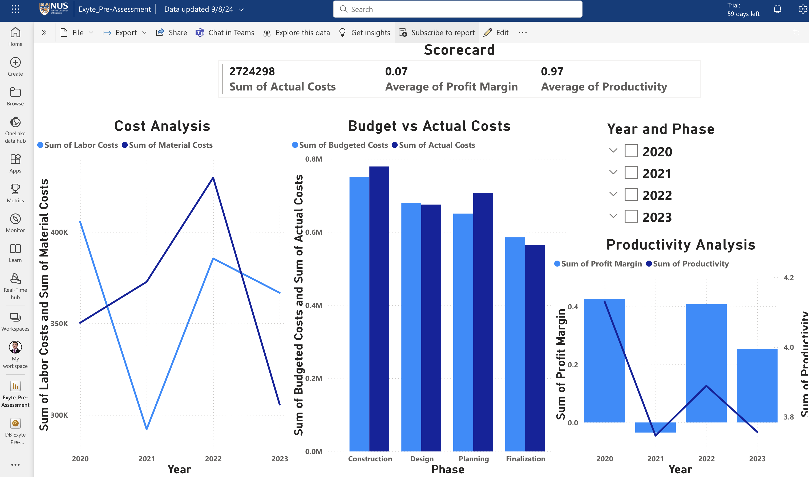

# PowerBI_visualization
Practice Power BI based on a Data Science Problem

---

## Background

You are a data analyst for a prominent consulting firm specializing in project performance evaluation. 
Recently, you have been assigned to assist the project manager of Zulu project, a construction project with a steady work scope which has a significant decline in profitability over the past three years. Your role is critical in identifying and analyzing relevant data to uncover the underlying factors contributing to this downward profitability trend. 
Using a data-driven approach,  you are tasked with conducting thorough analysis to identify the root causes of the decreased profit margins and provide actionable insights to support strategic decision-making within the project to improve profitability.

---

## Part A.1.: Business Questions

You will be meeting with the project manager to kick off your project. 
Propose 3 business questions to take to the meeting that could yield actionable insights into declining profitability on the Zulu Project. 
For each question, specify the data required to answer the question and business context to help him understand why it could be a potential root cause of margin erosion.

---

## Part A.1.: Answer

<u>**Question 1:**</u>
- Has the cost of raw materials or labor increased disproportionately compared to the original project estimates?

Data Required:
- Historical cost data of raw materials and labor over the past 3 years.
- Original project budget and cost estimates.
- Contractual agreements or price indices for key materials and labor.

Business Context:
- In construction projects, material and labor costs are significant contributors to overall project expenses. 
- If the costs of these inputs have increased significantly over time without corresponding adjustments in project pricing or efficiency, this could directly erode the profit margins.
- By comparing actual costs against original estimates, we can identify whether unexpected increases in input costs are driving the decline in profitability.

<u>**Question 2:**</u> 
- Are there specific project phases or tasks where the project is consistently overrunning the budget or schedule?

Data Required:
- Detailed project schedule with timelines and milestones.
- Actual vs. budgeted costs for each project phase or task.
- Historical project progress reports and delay logs.

Business Context:
- Cost overruns and schedule delays in specific phases of the project can significantly impact overall profitability.
- By analyzing which parts of the project consistently exceed budget or schedule, we can identify inefficiencies or mismanagement areas that contribute to margin erosion.
- This information can help the project manager focus on optimizing or restructuring those specific phases to improve profitability.

<u>**Question 3:**</u> 
- Has there been a decline in productivity or efficiency among the project workforce?

Data Required:
- Productivity metrics (e.g., output per labor hour) over the past 3 years.
- Workforce data, including headcount, overtime hours, and skill levels.
- Historical data on project delays attributed to workforce performance.

Business Context:
- A decline in workforce productivity or efficiency can lead to increased labor costs and extended project timelines, both of which can reduce profitability.
- Understanding whether there has been a decrease in productivity, and if so, identifying the root cause (e.g., inadequate training, low morale, or insufficient workforce) can provide actionable insights for improving efficiency and, ultimately, profit margins.

---

## Part A.2.: Low-Fi Power BI Canvas 
You decide to create some visual aids for each question to help the project manager understand why it could be the cause of declining profitability. 

Create a Low-Fi Power BI dashboard canvas to take to the meeting that includes the following:
- Graphs/charts addressing each of the 3 business questions.
- Explanation of how each graph/chart contributes to understanding the business questions.
- Use of slicers and scorecards to enhance the usability and functionality of the dashboard.

---

## Part A.2.: Answer
For initial Low-Fi Power BI mockup report, I generated a  which was then imported into Power BI service, consisting of columns “Year”, “Material Costs”, “Labor Costs”, “Phase”, “Budgeted Costs”, “Actual Costs”, “Productivity”, and “Profit Margin”. The Power BI report is saved .

<u>**Question 1: Cost Analysis**</u>
- Line chart with axis as “Year” and values as “Material Costs” and “Labor Costs”.
- Explanation: This chart shows trends in material and labor costs over time, helping identify if cost increases contribute to declining profitability.

<u>**Question 2: Budget vs. Actual Costs**</u>
- Clustered Column Chart with axis as “Phase”, and values as “Budgeted Costs” and “Actual Costs”.
- Explanation: This chart compares budgeted costs with actual costs across different project phases, highlighting where overruns may be occurring.

<u>**Question 3: Productivity Analysis**</u>
- Line and Stacked Column chart with axis as “Year”, values of line chart as “Productivity”, and values of stacked column chart as “Profit Margin”.
- Explanation: This visualization shows the relationship between productivity and profit margin, illustrating how changes in productivity impact profitability.

